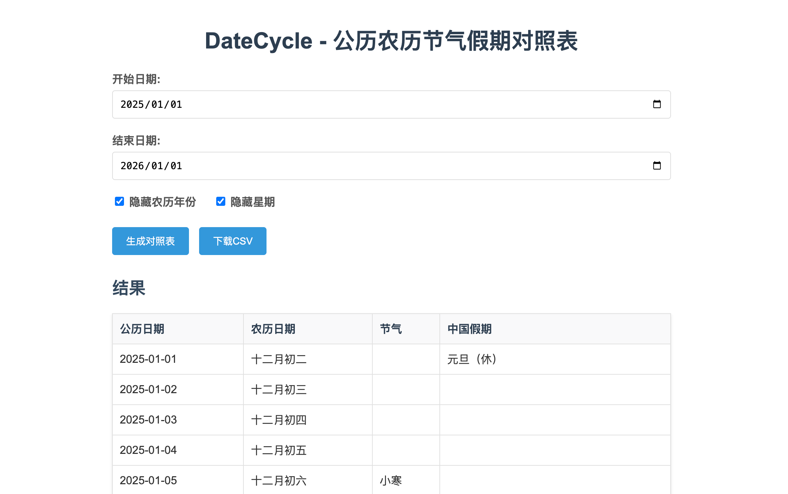

# DateCycle - 公历农历节气假期对照表

一个用于查询和下载公历、农历、节气和中国假期对照表的Web应用。



## 功能特点

- **日期范围**：支持2000年到2100年的日期范围
- **数据展示**：显示公历日期、农历日期、节气和中国假期
- **农历设置**：支持隐藏/显示农历年份
- **假期信息**：显示假期类型（休/班）
- **数据导出**：支持下载为CSV格式
- **界面友好**：浅色主题，清晰易读

## 技术实现

- **前端**：HTML5, CSS3, JavaScript
- **数据**：使用本地JSON数据文件
  - `database/all.json`：包含公历、农历和节气数据
  - `database/holidays/`：包含每年的假期数据
- **服务器**：Python HTTP Server（本地开发）

## 如何使用

### 本地运行

1. 进入项目目录
2. 启动本地服务器：
   ```bash
   python3 -m http.server 8000
   ```
3. 打开浏览器访问：`http://localhost:8000`

### 使用步骤

1. **选择日期范围**：在开始日期和结束日期输入框中选择要查询的日期范围
2. **农历设置**：勾选/取消勾选"隐藏农历年份"复选框
3. **生成对照表**：点击"生成对照表"按钮，查看结果
4. **下载CSV**：点击"下载CSV"按钮，下载对照表为CSV文件

## 数据说明

- **公历数据**：标准公历日期
- **农历数据**：包含农历年份、月份和日期
- **节气数据**：包含24节气信息
- **假期数据**：包含中国法定节假日和调休信息

## 注意事项

- 本应用使用本地数据文件，无需网络连接
- 假期数据可能会随年份更新而变化
- 对于大量日期范围的查询，可能需要较长时间处理

## 项目结构

```
DateCycle/
├── database/
│   ├── holidays/        # 每年的假期数据
│   │   ├── 2007.json
│   │   ├── 2008.json
│   │   └── ...
│   ├── json/            # 农历数据（按年）
│   ├── all.json         # 完整的公历农历节气数据
│   ├── all.bin
│   └── all.csv
├── index.html           # 主页面
├── script.js            # 主要逻辑
└── README.md            # 项目说明
```

## 浏览器兼容性

- 支持所有现代浏览器（Chrome, Firefox, Safari, Edge）
- 建议使用最新版本的浏览器以获得最佳体验

<br />

## 数据来源

- **农历数据库：**<https://github.com/hungtcs/traditional-chinese-calendar-database>
- 中国法定节假日数据：<https://github.com/NateScarlet/holiday-cn>

<br />

## 许可证

本项目采用 MIT 许可证。
